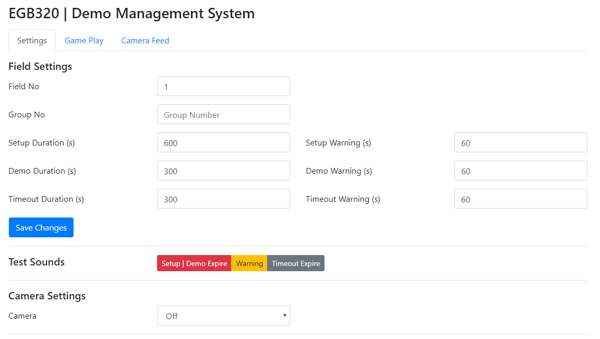
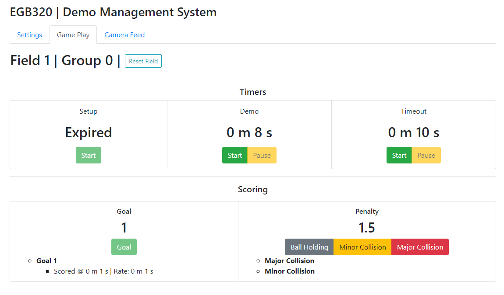
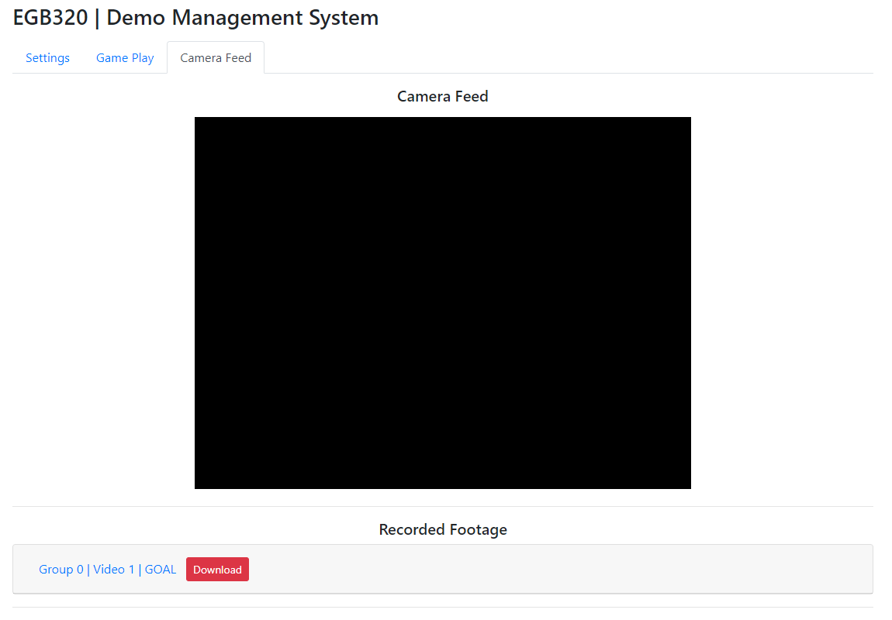

# EGB320 Demo Management System

QUT's EGB320 unit replicates RoboCup Small Size League and challenges the students to build soccer playing robots. This browser-based system is designed to be used during the final robot demonstrations to manage timing, scoring and video recording.

### Functionality
So far, the system:

- has three different timers for setup, demo and timeout.
  - Timers can generate one 'remaining time warning' at a specified time.

- plays three different sounds.
  - Referee whistle plays when the timers for setup and demo expire.
  - Boxing bell plays when the timers hit specified warning time.
  - Airhorn plays when the timeout timer expires.

- pauses the demo timer, when a goal is scored. The goal time and rate are displayed.
- keeps a record of penalties with the dedicated buttons.
- records video clips between the starts and the pauses of the demo timer, if a camera is activated.
- can download recorded clips through the provided links.
  - Javascript cannot access to the computer folders directly, so this step needs to be manual. If the videos are saved in a synced cloud folder, the upload process can be automatic. 

### Screenshots

|Settings                     |Game Play                      |Camera Feed                        |
|-----------------------------|-------------------------------|-----------------------------------|
||||

### Known Issues
- There is a codec issue with the recored footage. Despite the deafult extension is .mp4, most of the media players (except VLC) cannot play the downloaded videos.
